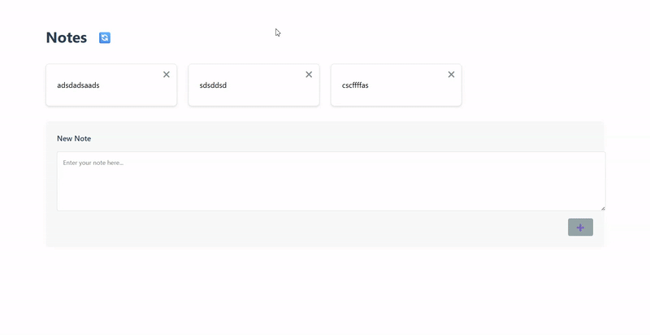

# CRUD

## Установка после клонирования репозитория

### backend
```
cd ra-homeworks-6-2
cd backend
npm install
npm start
```

### frontend
```
cd ra-homeworks-6-2
cd crud
npm install
npm run dev
```

## Деплой


Ссылка на публичную страницу: https://ra-homeworks-6-2-git-main-maxim-terltskiis-projects.vercel.app


